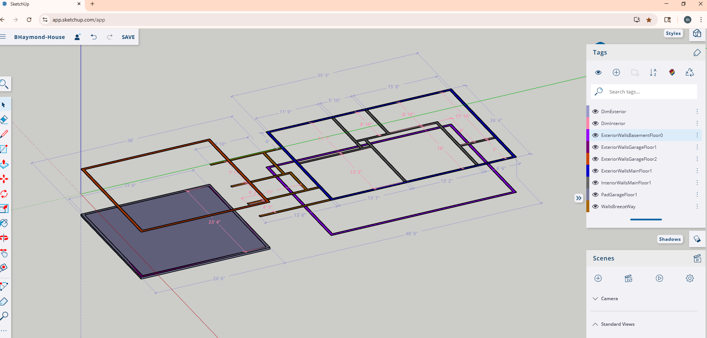

# BHaymond Project
- Company Website https://trees-aes.2cld.net/
- Project Portal https://th-twig.2cld.net/2384-120th-52659
- Project [Google Document](https://docs.google.com/document/d/1C3fvE9ydsNZtzJGNiOnm_bmmYELydahbby49De00Z4c/edit?tab=t.l1t8mmpcf255)
- Sketchup as thtwig https://app.sketchup.com/app
- GHouse [gmap](https://www.google.com/maps/place/Winfield,+IA+52659/@41.1333787,-91.4509073,46m/data=!3m1!1e3!4m6!3m5!1s0x87e6a4a40e491b21:0xc8a55d674581fc!8m2!3d41.123083!4d-91.4412683!16zL20vMHNfZHc?entry=ttu&g_ep=EgoyMDI0MTIwOS4wIKXMDSoASAFQAw%3D%3D)
- [BHouse-GooglePhotos](https://photos.app.goo.gl/NYSvFPn7CVhgcRq98)

---

- Sketchup as thtwig [https://app.sketchup.com/app](https://app.sketchup.com/app)
- PDF File of [BHaymond-House.pdf](./BHaymond-House.pdf) draft dimensions

---
---

---
---

---

# Reference
- Toilet [Layout Dimension](https://www.linkedin.com/pulse/blue-touch-lifestyles)
- Kitchen [Layout Dimensions](https://www.edrawsoft.com/free-kitchenlayout-templates.html)
- chris [Sketchup - notebooklm](https://notebooklm.google.com/notebook/bcc90fd3-5f1c-4e5a-8fa7-e1f896e3f288?pli=1)

