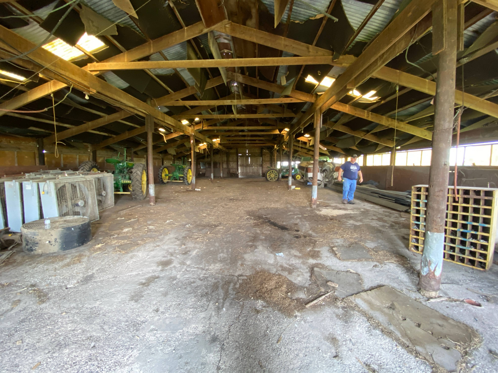

[edit]()
# Project 7783-CountyRdW66-52659 FHKlopFarms
- Company Website [https://fhklop.2cld.net/](https://fhklop.2cld.net/)
- Project Portal https://th-twig.2cld.net/7783-CountyRdW66-52659 (This document)
- Project Document [7783-CountyRdW66-52659 FHKlopFarms Project](https://docs.google.com/document/d/1UpW1VXP1gvoCF1ed0pVeq-bNSWCpxVY6_t44IU7Sc4g/edit?tab=t.0)
- Al-Trees [gmap](https://www.google.com/maps/place/Winfield,+IA+52659/@41.1737137,-91.4333369,115m/data=!3m1!1e3!4m6!3m5!1s0x87e6a4a40e491b21:0xc8a55d674581fc!8m2!3d41.123083!4d-91.4412683!16zL20vMHNfZHc?entry=ttu&g_ep=EgoyMDI1MDgxMy4wIKXMDSoASAFQAw%3D%3D)
- Al-Trees [Media Share]()
- Sketchup doc (thtwigllc) [web app 7783-CountyRdW66-52659](tbd)

- Pole section 18‘3“ by 15‘3“ six sections
- Side section 13’
- 10 foot height 
- 80” side height 

